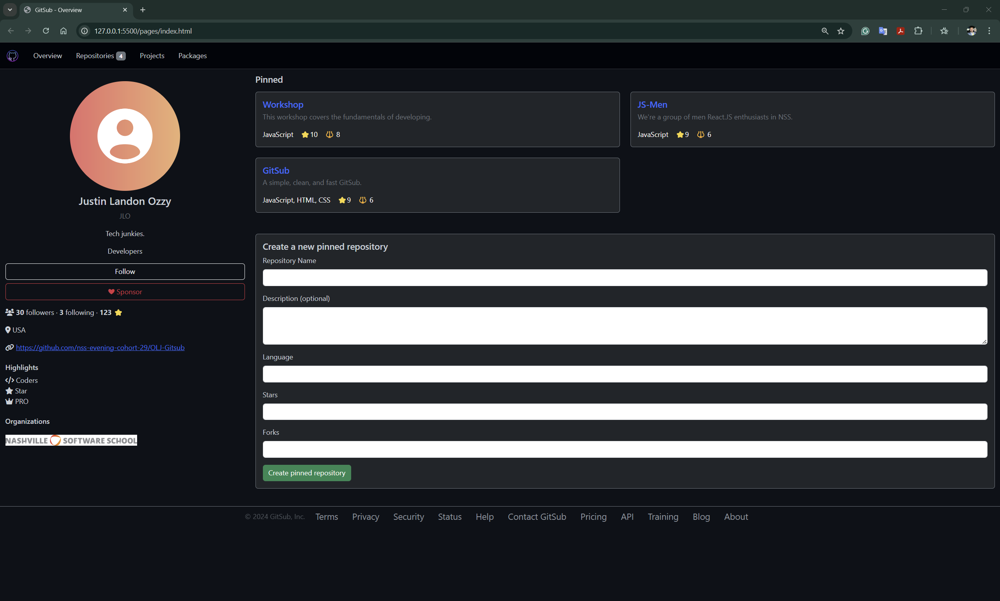
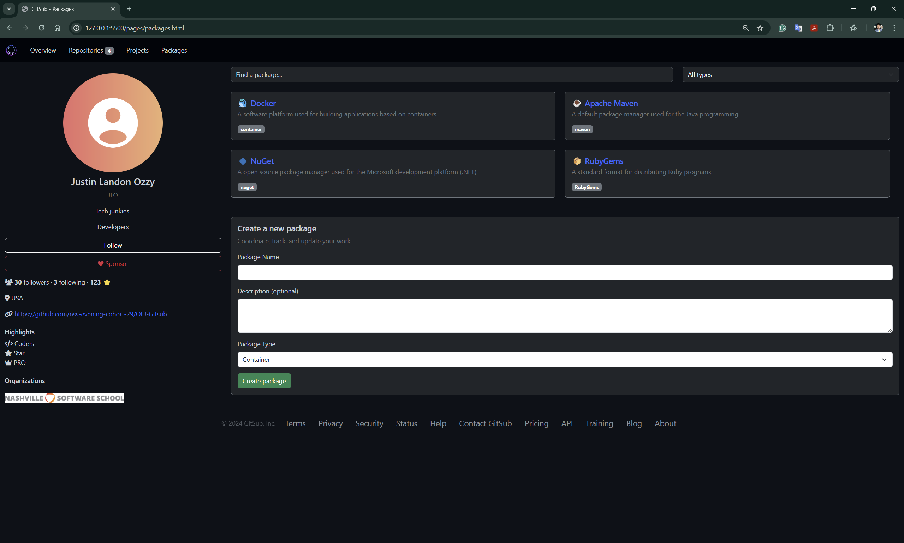
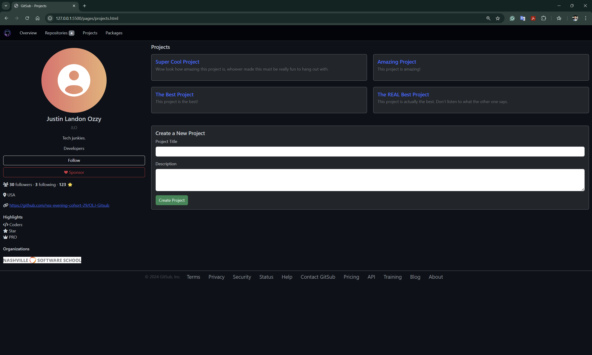
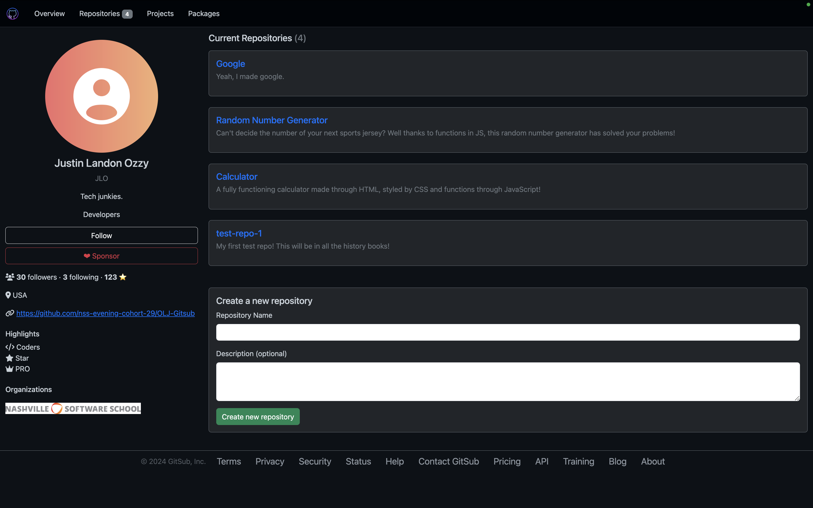

# GITSUB
## Overview
GITSUB is a GitHub-inspired web application with a comprehensive package, repository, and project management functionality. Built with vanilla JavaScript, HTML, CSS, and Bootstrap, it offers a responsive dark-themed interface for managing software development resources.

## Screenshots
*Overview Page: The main dashboard showing pinned repositories and profile information*

*Packages Page: Package management interface with filtering and creation options*

*Projects Page: Project cards and creation form for managing development initiatives*

*Repositories Page: Repository listing with detailed statistics and creation form*

## Loom Video
(https://www.loom.com/share/7cf1a8f172334e1394fc649a755f890c?sid=37e7d9f7-0dba-4fe4-9fde-d846ee57d01e)

## Project Links
- [ERD](https://dbdiagram.io/d/GitSub-OJL-6705c146fb079c7ebdcbd8e6)
- [Wireframe](https://www.figma.com/design/8vIX1yEXd2UxdWARbWqAje/GitSub?node-id=0-1&node-type=canvas)
- [Deployed Project](https://olj-gitsub.netlify.app/)

## User Story
As a software developer, I need a centralized platform to manage my repositories, packages, and projects. GITSUB provides an intuitive interface for organizing development resources while maintaining a familiar GitHub-like experience.

## Features
- Multi-page application (Overview, Packages, Projects, Repos)
- Package Management System
  - Filter and search packages
  - Support for multiple package types (Docker, Maven, npm)
  - Package creation interface
- Repository Management
  - Repository listing with detailed statistics
  - Pinned repositories feature
  - New repository creation
- Project Management
  - Project cards with descriptions
  - Project creation and organization
- Profile System
  - User profile sidebar
  - Organization affiliations
  - User statistics and bio

## Technical Details
### JavaScript Architecture
- Modular ES6 code structure
- Event-driven updates
- Separated concerns:

  #### `lists.js`: This file contains functions to filter and render lists of items such as packages, repositories, projects, and pinned repositories. Some key functions include:
   - filterPackages: Filters the packages based on search term and type.
   - renderPackages: Renders the filtered or all packages
   - renderRepositories: Renders the list of repositories.
   - renderProjects: Renders the list of projects.
   - renderPinnedRepos: Renders the list of pinned repositories.

  #### `forms.js`: This file contains form submission handlers for creating new projects, pinned repositories, repositories, and packages. It includes functions to handle form submissions, update the appData object, and re-render the respective lists. Some key functions include:
   - newProject: Handles the submission of a new project form.
   - newPinnedRepo: Handles the submission of a new pinned repository form
   - newRepository: Handles the submission of a new repository form
   - newPackage: Handles the submission of a new package form.

  #### `utils.js`: This file contains utility functions that are used across the application. Some key functions include:
   - loadComponent: Dynamically loads HTML components and initializes their functionality
   - getPackageIcon: Returns an icon based on the package type.
   - createCard: Creates HTML markup for a package item.
   - initializePackageSearch: Initializes the package search functionality.
   - updateActiveNavLink: Updates the active state of navigation links based on the current page.
   - renderNavbar, renderFooter, renderProfile: Functions to render the navigation bar, footer, and user profile sidebar respectively.

  #### `data.js`: This file contains a JavaScript object appData that holds all the data for the application. It includes user profile information, repositories, projects, packages, pinned repositories, site statistics, and site details like navigation and footer links. This data is used throughout the application to render various components.

### Styling
- Custom CSS variables for theming
- Bootstrap integration
- Responsive design principles
- Consistent dark theme

## Key Learnings
- ES6 Modules and code organization
- Event-driven architecture
- State management in vanilla JavaScript
- Responsive design implementation
- Dark theme implementation

## Challenges and Solutions
1. State Management:
   - Challenge: Managing data across multiple pages
   - Solution: Implemented centralized data management in data.js

2. Dark Theme:
   - Challenge: Consistent dark theme across components
   - Solution: Utilized CSS variables and Bootstrap dark theme classes

3. Responsive Design:
   - Challenge: Maintaining layout integrity across different screen sizes
   - Solution: Implemented Bootstrap grid system and custom breakpoints

4. Form Handling:
   - Challenge: Managing form submissions and validation across multiple forms
   - Solution: Created reusable form handlers in forms.js with validation logic

5. Dynamic Rendering:
   - Challenge: Efficiently rendering lists and cards with updated data
   - Solution: Developed modular rendering functions in lists.js with event-driven updates

6. Component Design:
   - Challenge: Creating consistent, reusable UI components
   - Solution: Established shared styling patterns and component templates

## Future Improvements
- Add database systems
- Implement real-time updates
- Add collaborative features
- Enhance search functionality
- Add more package type support

## Resources
- [Bootstrap Documentation](https://getbootstrap.com/)
- [JavaScript ES6 Modules](https://developer.mozilla.org/en-US/docs/Web/JavaScript/Guide/Modules)
- [CSS Custom Properties](https://developer.mozilla.org/en-US/docs/Web/CSS/Using_CSS_custom_properties)
- [Stack Overflow JavaScript](https://stackoverflow.com/questions/tagged/javascript)
- [GeeksForGeeks JavaScript](https://www.geeksforgeeks.org/javascript/?ref=shm)
- [Reddit JavaScript Community](https://www.reddit.com/r/javascript/)

## Contributors
- [Landon Borrego](https://github.com/lndnbrr) - Software Development student at Nashville Software School
- [Justin Glotzbach](https://github.com/justinglotz) - Software Developer based in Nashville, TN
- [Omer (Ozzy) Akben](https://github.com/omerakben) - Mental health whiz-turned-tech guru

## Contact
- GitHub Organization: [NSS Evening Cohort 29](https://github.com/nss-evening-cohort-29)
- Project Repository: [GitSub Team Project](https://github.com/nss-evening-cohort-29/OLJ-Gitsub)
- Team Members:
  - Landon Borrego - [GitHub](https://github.com/lndnbrr)
  - Justin Glotzbach - [GitHub](https://github.com/justinglotz) 
  - Omer (Ozzy) Akben - [GitHub](https://github.com/omerakben)
